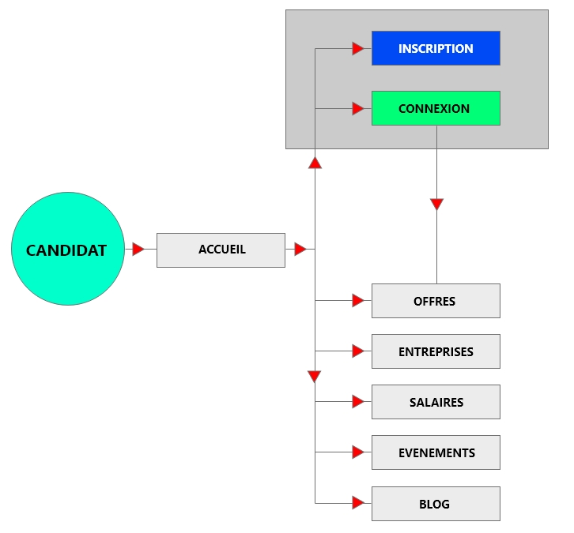

# CHOOSE YOUR BOSS

For this exercise in Html css, we will reproduce the page: https://www.chooseyourboss.com/. 

## Technical criteria

* Produce wireframe for phone, tablet and pc.
* Produce a functional tree structure of the application showing the possible use cases for the page.
* Your models were made with a model tool.
* Your wireframes are accessible in a DOC folder.
* The interface is a faithful reproduction of the original site
* The interface is responsive on all media
* HTML and CSS are validated
* HTML respects semantic rules
* CSS is organized
* Respect the DRY principle
* The code is commented
* The code is hosted on GitHub
* Use versioning software
* The site is hosted via a GH-page
* The repository contains a readme, description and tags
* Use a KANBAN-type project management tool

## WIREFRAME & FUNCTIONAL TREE

Functional Tree

Wireframe - Phone

Wireframe - Tablette

Wireframe - LapTop

